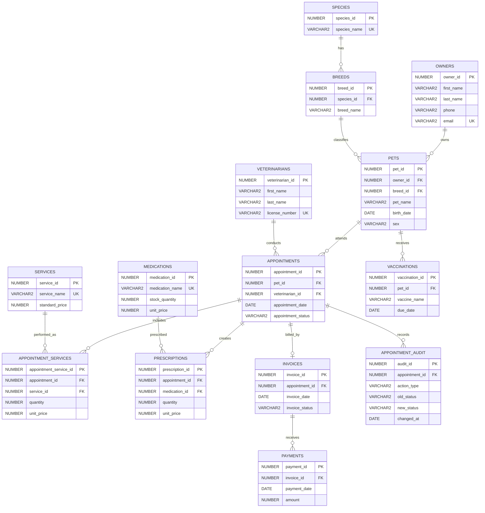

# Veterinary Clinic ER Diagram

The diagram shows the 14 required tables and their relationships. `APPOINTMENT_SERVICES` is the required many-to-many bridge between appointments and services. `PRESCRIPTIONS` is also a many-to-many bridge between appointments and medications.

The exact columns, rules, and indexes are documented in [design.md](./design.md).
